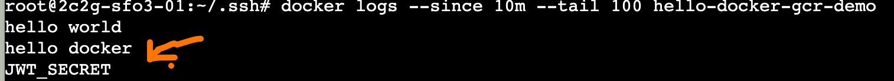

# 快速使用 github action 完成 ci/cd

[进入仓库](https://github.com/Wsgamer7/github-docker-deploy)

### 1. 创建一个 github 仓库然后加入


### 2. 创建一个 Dockerfile


### 3. 创建一个 github action, 它打包 docker 镜像并推送到 GitHub's Container Registry(GHCR)

创建文件夹`.github/workflows`，在其中加入文件`publish.yml` 并加入
name: publish

```
on:
  push:
    branches:
      - main

jobs:
  publish-hello-docker-image:
    runs-on: ubuntu-latest
    steps:
      - name: Checkout code
        uses: actions/checkout@v2
      - name: Login to GitHub Container Registry
        uses: docker/login-action@v1
        with:
          registry: ghcr.io
          username: ${{ github.actor }}
          password: ${{ secrets.GITHUB_TOKEN }}
      - name: Build the hello-docker Docker image
        run: |
          docker build . --tag ghcr.io/<github_username>/<image_name>:latest
          docker run ghcr.io/<github_username>/<image_name>:latest
          docker push ghcr.io/<github_username>/<image_name>:latest
```

**里程碑 1**: 每次 push main 分支时，github action 会自动打包 docker 镜像并推送到 ghcr.io/<github_username>/<image_name>:latest， 成功后会出现


# 是时候测试了！

#### 4. 让 github action ssh 到服务器，拉取镜像并运行

更新`publish.yml`

```
name: publish

on:
  push:
    branches:
      - main

jobs:
  publish-hello-docker-image:
    runs-on: ubuntu-latest
    environment: dg-cloud-vm
    steps:
      - name: Checkout code
        uses: actions/checkout@v2
      - name: Login to GitHub Container Registry
        uses: docker/login-action@v1
        with:
          registry: ghcr.io
          username: ${{ github.actor }}
          password: ${{ secrets.GITHUB_TOKEN }}
      - name: Build the hello-docker Docker image
        run: |
          docker build . --tag ghcr.io/<github_username>/<image_name>:latest
          docker run ghcr.io/<github_username>/<image_name>:latest
          docker push ghcr.io/<github_username>/<image_name>:latest
      - name: Setup SSH
        uses: webfactory/ssh-agent@v0.7.0
        with:
          ssh-private-key: ${{ secrets.SSH_PRIVATE_KEY }}
      - name: Deploy to Server
        run: |
          ssh -o StrictHostKeyChecking=no -p 22 root@164.92.82.131 << 'EOF'
            docker login ghcr.io -u <github_username> -p ${{ secrets.GITHUB_TOKEN }}
            docker pull ghcr.io/<github_username>/<image_name>:latest
            docker stop <image_name> || true
            docker rm <image_name> || true
            docker run -d --name <image_name> -p 8765:3000 -e JWT_SECRET=${{ secrets.JWT_SECRET }} ghcr.io/<github_username>/<image_name>:latest
          EOF

```

坑点 1. `environment: dg-cloud-vm`，需要在 github 仓库的 设置里加入环境

然后加入`SSH_PRIVATE_KEY`和其他你需要的环境变量(.env 文件里都放这里)

`SSH_PRIVATE_KEY`是一台**能 ssh 上服务器的机器的私钥**(比如写代码的电脑), 如果不知道就问 ai：如何用 ssh 连接到服务器，root@164.92.82.131是<服务器用户>@<服务器 ip>

坑点 2. 运行 docker 容器时加入坑点 1 里加入的环境变量

```
... -p 8765:3000 -e JWT_SECRET=${{ secrets.JWT_SECRET }} ghcr.io/<github_username>/<image_name>:latest
```

# 是时候测试了！

登入云服务器，查看 docker 是否拉取镜像成功


还记得 app.js 里的`console.log(process.env.JWT_SECRET);`吗？用这个**检查 docker run 是否被成功执行 + 环境变量是否被成功设置**，**查看 docker 日志**

```
docker logs --since 10m --tail 100 <image_name>
```



到此，github action 的 ci/cd 就完成了！
